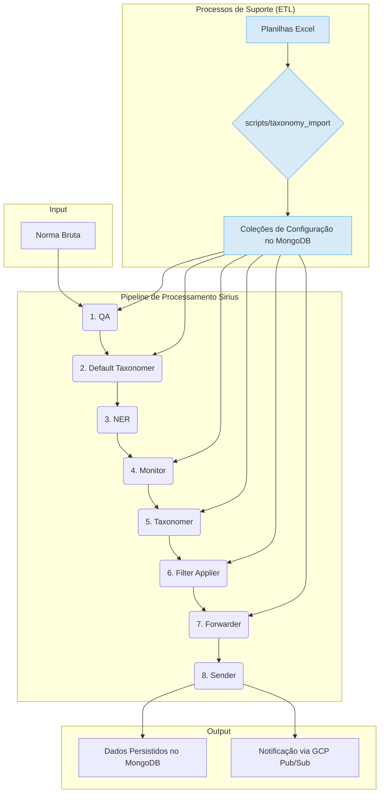

# Documentação Técnica Abrangente do Projeto Sirius

**Público-Alvo:** Engenheiros de Software e IAs de desenvolvimento sem contexto prévio do projeto.
**Objetivo:** Prover uma descrição exaustiva, de ponta a ponta, da arquitetura, fluxo de dados, módulos de processamento e algoritmos do sistema Sirius, com um mergulho profundo na lógica de classificação taxonômica.

---

## 1. Visão Geral e Arquitetura

O Sirius é um pipeline de processamento de documentos normativos, desenvolvido em Python, projetado para ser robusto, modular e altamente configurável. Sua função principal é ingerir documentos brutos ("normas"), submetê-los a um pipeline sequencial de múltiplos estágios para validação, enriquecimento, classificação e roteamento, e, por fim, persistir os resultados em um banco de dados MongoDB, notificando sistemas externos sobre a conclusão do processo via Google Cloud Pub/Sub.

A arquitetura é orientada a configurações, permitindo que a lógica de negócio seja gerenciada externamente através de planilhas Excel, sem a necessidade de alterações no código-fonte do pipeline.

### 1.1. Orquestração do Pipeline

O coração do Sirius é orquestrado por dois arquivos principais:

*   **`executor.py`**: Atua como o ponto de entrada para a execução do pipeline. É responsável por inicializar o `SiriusContext` (o objeto de estado), carregar os módulos do pipeline e iterar sobre eles na ordem correta. Ele é projetado para ser executado como uma função AWS Lambda.
*   **`sirius/branch_operators.py`**: Define a sequência exata de execução dos módulos através da lista `MODULES`. Além disso, contém a lógica de controle de fluxo, como o `JoinBranchOperator`, que gerencia a transição entre os estágios, mescla "ramos" de processamento e remove normas que falharam na validação.

### 1.2. Diagrama Completo do Fluxo de Processamento

O diagrama abaixo ilustra o fluxo de ponta a ponta, desde a entrada dos dados brutos até a persistência e notificação.



---

## 2. Análise Detalhada dos Módulos do Pipeline

### Estágio 1: `QA` (Quality Assurance)

*   **Responsabilidade**: Garantir a integridade, consistência e qualidade dos dados brutos. Atua como um porteiro rigoroso para o pipeline.
*   **Lógica Central**: `sirius/qa_analyzer.py` - Classe `QAAnalyzer`.
*   **Processo Detalhado**:
    1.  **Padronização de Chaves**: Renomeia campos de entrada para o padrão interno do sistema (ex: `data_publicacao` -> `publish_date`).
    2.  **Preenchimento e Correção**: Preenche campos `summary` vazios, sincroniza `issue_date` e `publish_date`, e utiliza um conjunto robusto de expressões regulares para corrigir e formatar datas a partir de diversos formatos textuais.
    3.  **Validação de Regras de Negócio**:
        *   Valida se as datas são reais e não estão no futuro.
        *   Rejeita documentos cujo título começa com "despesa" (regra para filtrar balancetes).
        *   Verifica se campos essenciais (`content`, `title`, `number`, etc.) não estão vazios.
    4.  **Status**: Se qualquer validação falhar, a norma recebe `sirius_status = -1` e é removida do fluxo principal no próximo `JoinBranchOperator`. Caso contrário, recebe `sirius_status = 1`.
    5.  **Enriquecimento**: Para normas aprovadas, adiciona os campos `normalized_type` e `consolidated_type` com base em um mapeamento pré-definido.

### Estágio 2 e 5: `Default Taxonomer` e `Taxonomer` (Mergulho Profundo)

*   **Responsabilidade**: Classificar a norma, atribuindo-lhe uma `class` e `subclass`. Este é um dos estágios mais complexos e centrais do Sirius.
*   **Diferença**:
    *   **`Default Taxonomer` (Estágio 2)**: Aplica uma taxonomia genérica como primeira camada de classificação. O resultado é armazenado no campo `default_taxonomy`. Serve como uma classificação de base.
    *   **`Taxonomer` (Estágio 5)**: Aplica taxonomias específicas do cliente, com base na origem do documento e no cliente associado. Este resultado é mais refinado e **sobrescreve** a classificação anterior na raiz do documento (`class`, `subclass`).

A lógica de ambos os estágios é a mesma, variando apenas a taxonomia que é carregada. A seguir, um detalhamento exaustivo de como este sistema funciona, desde a origem dos dados até o algoritmo de classificação.

#### 2.1. Fase de Ingestão de Taxonomia (ETL Offline)

Esta fase traduz o conhecimento de negócio, expresso em planilhas, para uma estrutura de dados que o sistema possa consumir eficientemente. O ponto de entrada é o script [`scripts/taxonomy_import/taxonomy.py`](scripts/taxonomy_import/taxonomy.py).

##### 2.1.1. Fontes de Dados (Artefatos de Entrada)

*   **Arquivo de Mapeamento de Domínios: `Dominios_Taxonomia.xlsx`**
    *   **Intenção:** Funciona como um roteador de configurações, desacoplando as definições de taxonomia das empresas e fontes que as utilizam.
    *   **Formato:** Contém as colunas `dominio` (nome do arquivo de taxonomia), `origem` (fonte do documento), `empresa` e `ID_EMPRESA`.
    *   **Lógica:** Uma linha com `(BACEN_GENERICA, BACEN, IPT, 3)` significa: "Para normativos da empresa com ID `3` cuja origem seja `BACEN`, o sistema deve usar as regras definidas no arquivo `BACEN_GENERICA.xlsx`".

*   **Arquivos de Definição de Taxonomia: `taxonomies/*.xlsx`**
    *   **Intenção:** Contêm a hierarquia e as palavras-chave de cada taxonomia.
    *   **Formato:** Contém as colunas `grupo` (classe), `tema` (subclasse), `tag` (palavra-chave), `peso` (influência da tag) e `area` (unidades de negócio para roteamento).

##### 2.1.2. Processo de Transformação e Carregamento

O script `taxonomy.py` lê os arquivos Excel e os converte em várias coleções no MongoDB, incluindo `taxonomy`, `taxonomy_class`, `taxonomy_subclass`, `taxonomy_config` e, crucialmente, `routing_rule`, que automatiza o despacho de normativos para as equipes corretas com base na sua classificação. O processo apaga os dados antigos e recarrega os novos, garantindo consistência.

#### 2.2. Fase de Classificação (Runtime)

*   **Lógica Central**: [`sirius/util/classification.py`](sirius/util/classification.py) - Função `tag_documents`.
*   **Fluxo de Execução**:
    1.  **Seleção da Taxonomia:** O sistema consulta a coleção `taxonomy_config` para determinar qual taxonomia usar com base no cliente e na origem do normativo.
    2.  **Estratégia de Duas Passadas:** Para otimizar, primeiro tenta classificar usando o campo `summary`. Se falhar, tenta novamente com o campo `content` (texto completo).

*   **Algoritmo de Classificação (TF-IDF Ponderado e Direcionado)**:
    1.  **Padronização (`standardizer`):** O texto do normativo e as tags são normalizados (minúsculas, sem acentos) para uma comparação justa.
    2.  **Vetorização TF-IDF Direcionada (`create_vectorizer`):**
        *   **Intenção:** Converter texto em números, dando peso a termos relevantes.
        *   **Parâmetro Chave: `vocab=tags`**: Este é o coração do algoritmo. O vocabulário do vetorizador é **explicitamente limitado ao conjunto de tags da taxonomia**. Isso significa que o algoritmo **ignora todas as palavras do normativo que não sejam uma tag pré-definida**, tornando o processo extremamente rápido e focado.
        *   **N-gramas:** O sistema é configurado para tratar tags com múltiplas palavras (ex: "lavagem de dinheiro") como um único termo.
    3.  **Cálculo de Score e Seleção:**
        *   **Ponderação:** O score TF-IDF de cada tag encontrada é multiplicado pelo seu `peso` definido na planilha. `score_final_tag = score_tfidf * peso`.
        *   **Agregação:** Os scores finais das tags são somados por cada combinação de `class`/`subclass`.
        *   **Seleção do Vencedor:** A combinação `(class, subclass)` com a maior soma de scores é a vencedora. Em caso de empate, a primeira encontrada é escolhida.

### Estágio 3: `NER` (Named Entity Recognition)

*   **Responsabilidade**: Extrair entidades pré-definidas (como organizações, pessoas, etc.) do texto.
*   **Lógica Central**: `sirius/modules/ner/spacy_entities.py`.
*   **Processo Detalhado (NER Baseado em Dicionário)**:
    1.  **Dicionário Centralizado**: Carrega uma lista de entidades da coleção `entities` do MongoDB.
    2.  **Construção de Modelo Dinâmico**: Cria um modelo spaCy em branco e utiliza o `EntityRuler`, um componente otimizado para busca por dicionário.
    3.  **Busca Case-Insensitive**: Os padrões de busca são configurados para ignorar maiúsculas/minúsculas.
    4.  **Extração**: Processa o texto da norma e extrai as entidades encontradas, que são adicionadas à lista `norm['entities']`.

### Estágio 4, 6 e 7: O Funil de Regras de Negócio

Estes três módulos trabalham em conjunto para determinar a relevância e o destino de cada norma.

1.  **`Monitor` (Estágio 4 - Triagem)**:
    *   **Objetivo**: Primeira triagem para identificar normas de interesse para os clientes.
    *   **Lógica**: Aplica regras booleanas complexas para encontrar correspondências de palavras-chave e popula o campo `norm['monitors']`.

2.  **`Filter Applier` (Estágio 6 - Exclusão)**:
    *   **Objetivo**: Aplicar filtros de exclusão para remover falsos positivos.
    *   **Lógica**: Aplica "filtros de despacho" (`dispatch_filter`) e popula o campo `norm['skip_dispatches']`.

3.  **`Forwarder` (Estágio 7 - Roteamento)**:
    *   **Objetivo**: Determinar o destino final e exato da norma.
    *   **Lógica**: Aplica "regras de roteamento" (`routing_rule`) e cria o campo `norm['company_norms']`, a estrutura de dados final para o envio.

### Estágio 8: `Sender` (Persistência e Notificação)

*   **Responsabilidade**: O estágio final, que salva o resultado do processamento e notifica sistemas externos.
*   **Lógica Central**: `sirius/modules/sender/nservice.py` - Classe `NormativeService`.
*   **Processo Detalhado**:
    1.  **Persistência em Lote**: Converte o objeto da norma e o salva em lote nas coleções `norm`, `normative_un` e `associated_uns` do MongoDB.
    2.  **Indexação**: Indexa os dados no Elasticsearch para buscas avançadas.
    3.  **Notificação Externa**: Publica uma mensagem no Google Cloud Pub/Sub.

---

## 3. Conclusão

O Sirius é um sistema de processamento de dados bem-arquitetado, cuja força reside em sua modularidade, no fluxo de controle de qualidade contínuo e, principalmente, na sua arquitetura orientada a configurações. A separação clara entre o motor de processamento e a lógica de negócio (gerenciada externamente) torna o sistema poderoso, flexível e de fácil manutenção.

---

## Apêndice: Guia Detalhado para Rastrear a Associação de um Normativo a um Cliente via Taxonomia

Este apêndice fornece um procedimento técnico detalhado para verificar e provar como um normativo específico foi associado a um cliente através do mecanismo de taxonomia do Sirius. Este guia assume acesso de leitura ao banco de dados MongoDB do sistema.

### Pré-requisitos

Para iniciar a análise, você precisará das seguintes informações:
*   **ID do Normativo (`normative_id`):** O `_id` único do documento normativo que você deseja investigar.
*   **ID do Cliente (`company_id`):** O `_id` único do cliente para o qual você está verificando a associação.

### Passo 1: Obter os Dados de Classificação e Origem do Normativo

O primeiro passo é consultar o documento do normativo para extrair as informações essenciais geradas pelo processo de taxonomia e seus metadados de origem.

**Ação:** Execute uma consulta na coleção de normativos (assumindo o nome `normatives`) para encontrar o documento pelo seu `_id`.

**Exemplo de Consulta (Mongo Shell):**
```javascript
db.normatives.findOne({ "_id": ObjectId("63e53e2f1b3e8a4a3c8e4b1a") })
```

**Análise do Resultado:**
Você receberá um documento JSON. Localize os seguintes campos-chave:

*   `class`: A classe atribuída pela taxonomia.
*   `subclass`: A subclasse atribuída pela taxonomia.
*   `source`: A origem do documento.

**Exemplo de Documento Normativo (Resultado Parcial):**
```json
{
  "_id": ObjectId("63e53e2f1b3e8a4a3c8e4b1a"),
  "title": "Circular nº 3.978",
  "source": "BACEN",
  "summary": "Dispõe sobre a política de prevenção à lavagem de dinheiro...",
  "content": "O Banco Central do Brasil, na forma do art. 9º da Lei nº 4.595...",
  "class": "Prevenção à Lavagem de Dinheiro",
  "subclass": "Política de Prevenção",
  "tags": "lavagem de dinheiro|plano de ação|monitoramento de operações"
}
```
Com base neste exemplo, agora temos os dados para a próxima etapa:
*   **Classe:** `"Prevenção à Lavagem de Dinheiro"`
*   **Subclasse:** `"Política de Prevenção"`
*   **Origem:** `"BACEN"`

### Passo 2: Encontrar a Regra de Roteamento (O Elo de Ligação)

Agora, vamos usar os dados da Etapa 1 para encontrar a regra específica que conectou este normativo classificado ao cliente. A evidência dessa conexão reside na coleção `routing_rule`.

**Ação:** Construa uma consulta complexa na coleção `routing_rule` que corresponda a todos os nossos critérios.

**Intenção da Consulta:** Estamos procurando por um documento de regra que diga: "Para a empresa X (`company_id`), existe uma regra que se aplica a documentos da origem Y (`source`) E que é acionada por uma classificação com a classe Z (`class`) E a subclasse W (`subclass`)?".

**Exemplo de Consulta (Mongo Shell):**
```javascript
db.routing_rule.findOne({
  // Critério 1: A regra deve pertencer ao cliente que estamos investigando.
  "company_id": ObjectId("5f5a6b3e8a4a3c8e4b1a2b3c"), 

  // Critério 2: A regra deve ser aplicável à origem do nosso normativo.
  "source_ids": "BACEN",

  // Critério 3 (Complexo): As condições da regra devem corresponder à classificação do normativo.
  // Usamos $all e $elemMatch para garantir que AMBAS as condições de classe e subclasse existam no mesmo documento de regra.
  "$and": [
    { 
      "rules": {
        "$elemMatch": {
          "key": "class",
          "values": "Prevenção à Lavagem de Dinheiro"
        }
      }
    },
    {
      "rules": {
        "$elemMatch": {
          "key": "subclass",
          "values": "Política de Prevenção"
        }
      }
    }
  ]
})
```

### Passo 3: Analisar o Resultado da Consulta

A resposta a esta consulta determinará conclusivamente se a associação foi feita pela taxonomia.

#### Cenário de Sucesso: Regra Encontrada

Se a consulta da Etapa 2 retornar um documento, você terá a prova definitiva.

**Exemplo de Documento `routing_rule` (Resultado):**
```json
{
  "_id": ObjectId("61c2a3b4c5d6e7f8g9h0i1j2"),
  "company_id": ObjectId("5f5a6b3e8a4a3c8e4b1a2b3c"),
  "source_ids": ["BACEN", "CVM"],
  "taxonomy_name": "BACEN_BRADESCO",
  "rules": [
    { "key": "class", "values": ["Prevenção à Lavagem de Dinheiro"], "operator": "equal" },
    { "key": "subclass", "values": ["Política de Prevenção"], "operator": "equal" }
  ],
  "un_ids": [
    { "un_id": ObjectId("5f5a6b3e8a4a3c8e4b1a9d8e"), "relevancy": 1, ... },
    { "un_id": ObjectId("5f5a6b3e8a4a3c8e4b1a9f7g"), "relevancy": 1, ... }
  ]
}
```

**Conclusão da Análise:**
*   **Confirmação:** A existência deste documento confirma que o normativo foi associado ao cliente porque sua classificação (`Prevenção à Lavagem de Dinheiro` -> `Política de Prevenção`) acionou esta regra de roteamento.
*   **Detalhe da Associação:** O campo `un_ids` revela exatamente *para quais áreas/unidades de negócio* do cliente o normativo foi direcionado. Neste exemplo, ele foi enviado para as unidades com IDs `5f5a6b3e8a4a3c8e4b1a9d8e` e `5f5a6b3e8a4a3c8e4b1a9f7g`.

#### Cenário de Falha: Nenhuma Regra Encontrada

Se a consulta da Etapa 2 retornar `null` (nenhum documento encontrado), a conclusão é diferente.

**Conclusão da Análise:**
*   **Confirmação:** A ausência de uma regra correspondente significa que **a taxonomia não foi o mecanismo que vinculou este normativo a este cliente**.
*   **Próximos Passos:** Embora o normativo tenha sido classificado, não havia uma regra de negócio configurada (via `area` na planilha Excel) para roteá-lo para este cliente específico com base nessa classificação. A associação, se ocorreu, deve ter sido através de outro mecanismo do sistema (ex: um monitoramento manual, uma regra de encaminhamento diferente, etc.), que estaria fora do escopo da lógica de taxonomia.